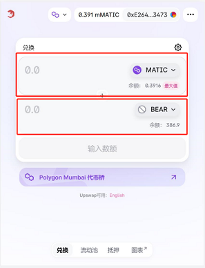
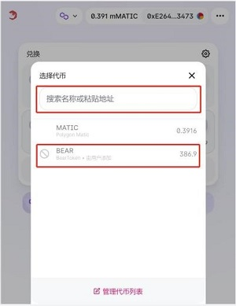
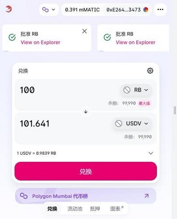
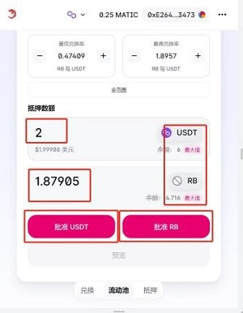
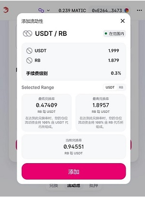
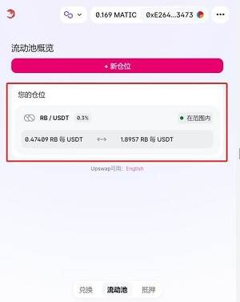
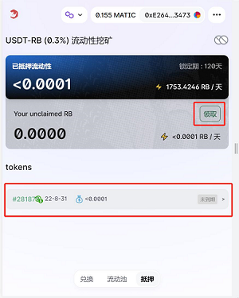

UPswap操作流程介绍
=======================

进入交易所
--------------

在钱包（imtoken、TP等）中输入交易所地址https://www.upswap.org，进入交易所。

兑换
-------------
进入后选择相应的交易对，输入兑换数量，然后进行授权，点击兑换。
如果找不到相应的币，则点击 :guilabel:`选择代币`，输入合约地址或者名称搜索要兑换的币。

  

添加流动性
---------------

点击 :guilabel:`流动性`，点击 :guilabel:`+新仓位`，添加流动性。
 
.. figure:: img/upswap-3-1.jpg  

选择要添加的交易对，选择USDT和RT币对。选择好后如下图所示。
设置兑换率范围，保证“当前兑换率”界于“最低兑换率”和“最高兑换率”之间。

   
输入要抵押的数量（输入USDT或RT均可），输入任何一个币的数量会自动填补另一个币所需数量。然后点击 :guilabel:`批准USDT` 和  :guilabel:`批准RT` 进行授权，授权完成后点击 :guilabel:`预览` ，确认无误后进行添加。
   

添加完成后会在下图展示添加的流动性。
 

抵押
--------------
打开抵押页面，选择要抵押的天数，点击进去。选择要抵押的流动性，可抵押的流动性会标示 :guilabel:`可抵押`，点击进行抵押。抵押完成后可查看抵押的流动性。点击 :guilabel:`领取` 可领取每天获得的收益。

