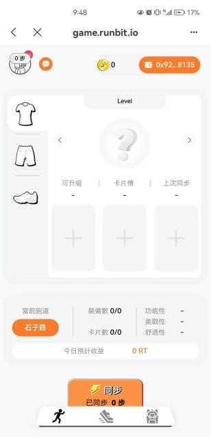
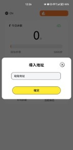
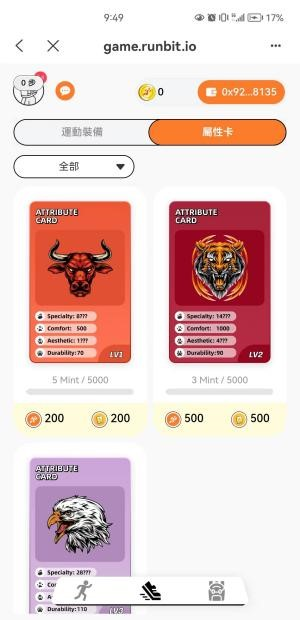
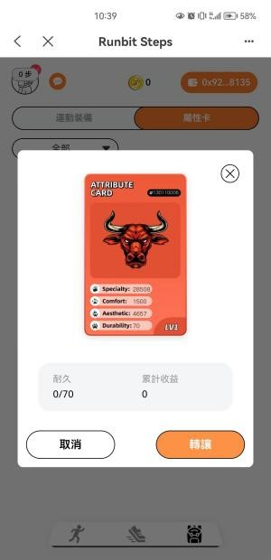
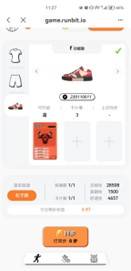
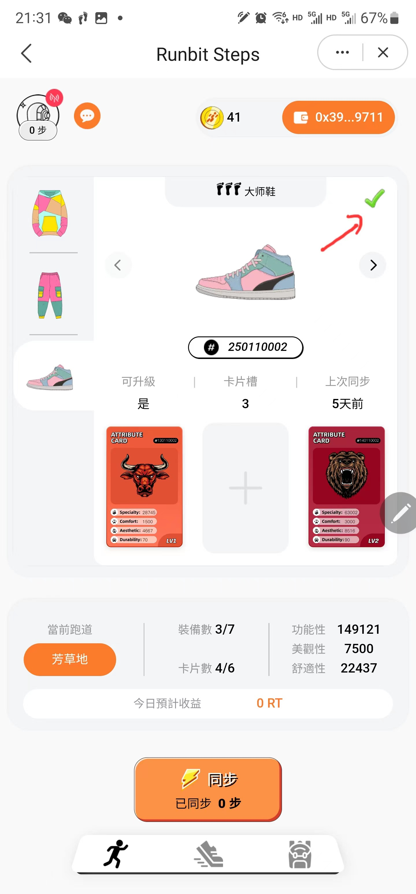
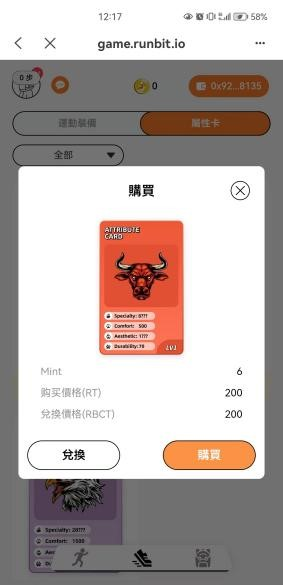
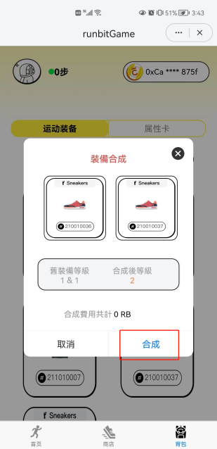
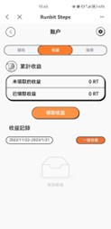

RunBit游戏操作流程介绍
======================
进入游戏
----------
打开 :guilabel:`imtoken` 或者 :guilabel:`TokenPocket` 等钱包，选择Matic（Polygon）链，在DAPP浏览器栏输入游戏地址https://game.runbit.org，点击打开。

.. _fig_0101:
.. figure:: img/1.jpg

 
激活游戏
----------
进入游戏后，会弹出 :guilabel:`请输入激活码` 提示，填入上级推荐人地址，确定激活，激活后进入游戏首页。

.. _fig_0201:

.. _fig_0202:

绑定计步APP
------------
首先通过手机浏览器下载安装计步APP，下载地址
https://game.runbit.org/appdownload/runbit.apk
安装完成后打开APP，在右上角输入框中输入自己的钱包地址，进行绑定。

.. _fig_0301:

.. _fig_0302:

购买装备和属性卡
-----------------
点击商店，选择要购买的装备或者属性卡，确认购买。首次购买会弹出授权弹窗，点击 :guilabel:`授权`，授权会消耗少量MATIC作为GAS费。再次点击进行购买，支付相应的RB购买。要保证钱包里有足够的RB和MATIC。购买的装备和属性卡可在背包中查看。
    

.. figure:: img/4-1.jpg

给装备添加属性卡
-----------------
打开背包，选择要添加属性卡的装备，比如鞋子，上衣或裤子。打开选择的装备，点击 :guilabel:`+`，选择要添加的属性卡，确认添加。
   

选择赛道，添加装备
------------------
1. 点击赛道，选择好赛道后进行确定。

.. 注意::
    选择好赛道后需要添加对应的装备，否则会减少收益。

.. figure:: img/6-2.jpg 

1. 添加和卸下装备

+ 添加装备：选择好赛道后，要对应赛道添加装备，比如石子路必须穿鞋子。点击人物上的对应 :guilabel:`+`，上中下分别为上衣、裤子、鞋子。点击后选择对应的装备进行添加。添加完成后如图所示。
+ 卸下装备：点击要卸下装备的部位，点击打开后，点击 :guilabel:`卸下`，授权进行卸下装备。卸下后将不再获得对应的收益。
 

上述操作完成后，方可进行计步运动，每天完成要求的步数，同时在游戏里同步计步APP里的步数，即可获得相应的收益。

兑换装备或者属性卡
-------------------
打开商店，选择要兑换的装备或者属性卡，点击兑换，然后输入密码进行授权，授权完成后，再次点击兑换，支付相应数量的碎片，即可完成兑换。
  

合成更高级装备
--------------------
打开背包，点击“去合成”，添加2个等级和类型相同的装备，点击“合成”，支付一定的合成费用，合成高一级别的装备。合成后可在背包中查看。

查看和提取收益
------------------
在首页点击左上角的头像，进入个人账户页面，可以查看当前账户拥有的RB、属性卡碎片、装备碎片数量。
点击“收益”后，点击“领取收益”，可以提取每天获得的收益。
点击“抽奖”，可以查看通过抽奖获得的RB、属性卡碎片、装备碎片数量。
    

